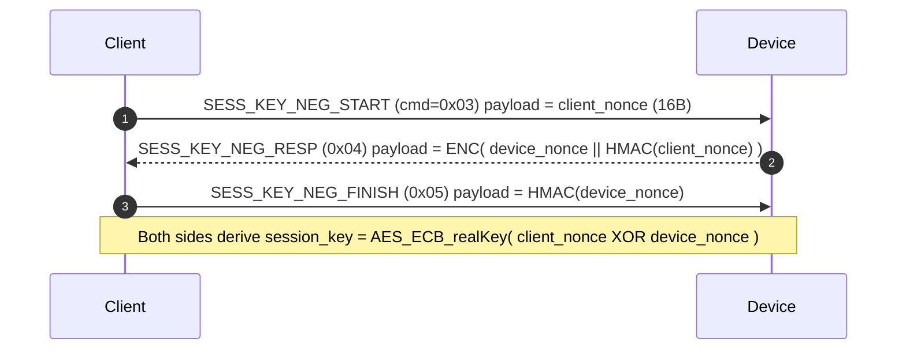
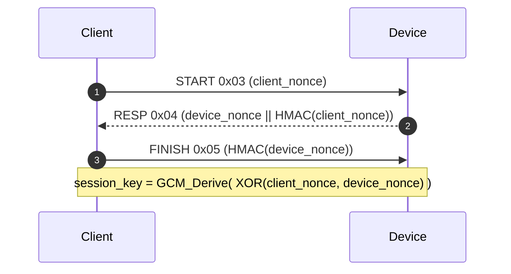
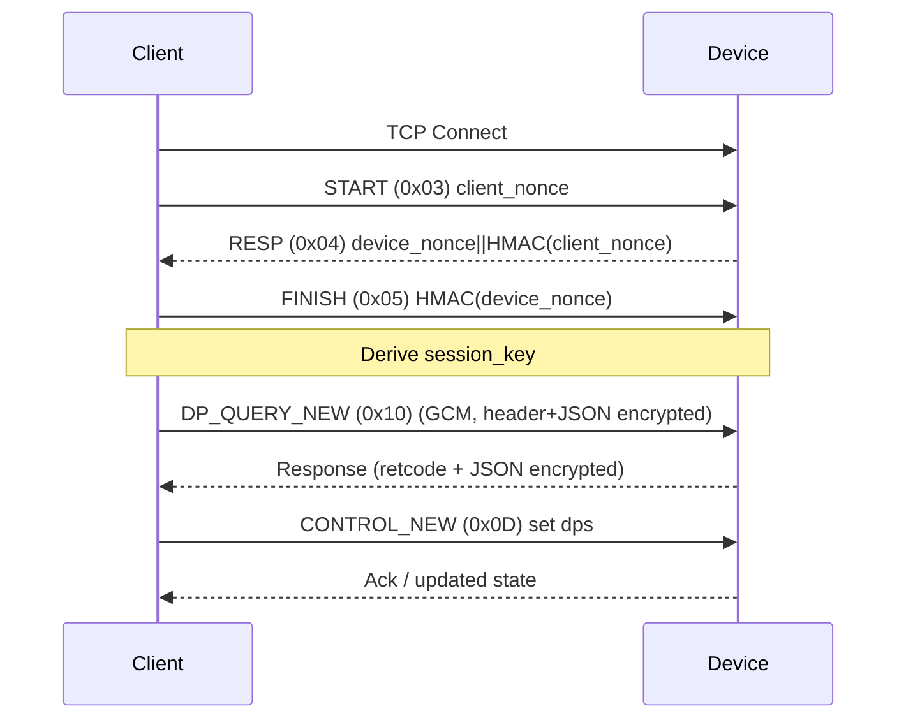

# Tuya Local Protocol Reference

This document explains how TinyTuya communicates locally with Tuya Wi‑Fi (and some Zigbee-over-gateway) devices across protocol revisions 3.1 → 3.5. It focuses on on‑LAN packet formats, encryption, session key negotiation, discovery, and command construction. (Cloud protocol is out of scope here.)

Supported revisions: 3.1, 3.2, 3.3, 3.4, 3.5. Each revision incrementally tightens security or changes framing.

Sections below are self‑contained; skim the one matching your device firmware (see discovery output or `Device.set_version()`).

---
## Quick Comparison

| Version | Handshake | Transport Frame | Payload Crypto | Header Visibility | Integrity | Monitoring Requires Key? | Control Requires Key? |
|---------|-----------|-----------------|----------------|-------------------|-----------|--------------------------|-----------------------|
| 3.1     | None      | 55AA legacy     | AES-ECB (CONTROL only) + MD5 slice | Version+MD5 prefix (CONTROL) | CRC32                 | No                       | Yes (CONTROL)          |
| 3.2*    | None      | 55AA legacy     | AES-ECB all cmds (except some DP_QUERY clear header rules) | 3.x header (clear) after encryption | CRC32 | Yes                      | Yes                   |
| 3.3     | None      | 55AA legacy     | AES-ECB all cmds (like 3.2) | 3.x header (clear) after encryption | CRC32 | Yes | Yes |
| 3.4     | Session key (3-way) | 55AA legacy | AES-ECB (session key) | 3.x header INCLUDED INSIDE encryption | HMAC-SHA256 | Yes | Yes |
| 3.5     | Session key (3-way) | 6699 (GCM)  | AES-GCM per packet (session key) | 3.x header inside ciphertext | AES-GCM Tag | Yes | Yes |

*3.2 devices are rare; behavior effectively mirrors a 3.3 "device22" (see device type notes).

Terminology: "device22" = devices whose `gwId` length is 22 chars requiring `CONTROL_NEW` (0x0d) for DP queries with an explicit DPS list.

### At a Glance (All Versions)
| Ver | Frame | Integrity | Crypto Scope | Handshake | Version Header Visibility | Source Header | Retcode Location | Notable Command Quirk |
|-----|-------|-----------|--------------|-----------|---------------------------|---------------|------------------|-----------------------|
| 3.1 | 55AA  | CRC32     | CONTROL only (AES-ECB+base64) | None | N/A (MD5 slice prefix only) | No | Clear field | Status plaintext, control encrypted |
| 3.2 | 55AA  | CRC32     | All encryptable cmds (AES-ECB) | None | Clear (when present) | No | Clear field | May require device22 DP list |
| 3.3 | 55AA  | CRC32     | All encryptable cmds (AES-ECB) | None | Clear | Clear (updates) | Clear field | Introduces Source header |
| 3.4 | 55AA  | HMAC-SHA256 | All (AES-ECB session key) | 3-msg | Encrypted | Encrypted | Clear field (HMAC covered) | Session key negotiation |
| 3.5 | 6699  | GCM Tag   | All (AES-GCM) | 3-msg | Encrypted | Encrypted | Inside ciphertext | Global seq; optional solicitation discovery |

Cross-reference: framing & packing logic lives in `tinytuya/core/message_helper.py` (`pack_message`, `unpack_message`); session negotiation in `tinytuya/core/XenonDevice.py` (`_negotiate_session_key*`); device22 detection in `XenonDevice._decode_payload` (look for `"data unvalid"`).

---
## Shared Concepts

### Command IDs (subset)
```
0x07 CONTROL        Set DP values
0x08 STATUS         (legacy status report)
0x09 HEART_BEAT
0x0A DP_QUERY       Query Data Points
0x0D CONTROL_NEW    New control frame (used for device22 + 3.4+ override)
0x10 DP_QUERY_NEW   New DP query (used in 3.4+/3.5 overrides)
0x12 UPDATEDPS      Request async DP refresh
0x03/0x04/0x05      Session key negotiation (3.4+)
0x40 LAN_EXT_STREAM Extended (e.g., gateway subdevice ops)
```

### DPS JSON Skeleton
Typical control payload (pre‑encryption) for a basic switch:
```json
{"devId":"<id>", "uid":"<id>", "t":"<epoch>", "dps":{"1":true}}
```
3.4+/3.5 reduce required identifiers; many fields become optional (see per‑version details). Sub‑devices (Zigbee via gateway) add `cid` and wrap DPS inside `data`.

### Version Header ("3.x header")
`<ascii version><12 x 0x00>` (e.g. `b"3.3\x00..."` length = 3 + 12). Presence and encryption differs by version and command (skipped for `DP_QUERY`, `UPDATEDPS`, `HEART_BEAT`, session negotiation, `LAN_EXT_STREAM`).

### "Version Protocol" Source Header (overview)
For v3.3+ some messages (STATUS/DP updates, sometimes CONTROL responses) begin with an additional 24-byte ASCII hex prefix before the encrypted or decrypted JSON payload:

`3.xCCCCCCCCSSSSSSSSUUUUUUUU`

Where:
* `3.x` – ASCII protocol version (e.g. `3.3`, `3.4`, `3.5`).
* `CCCCCCCC` – 8 hex chars CRC32 of message for cloud/MQTT sourced traffic; `00000000` for LAN-sourced frames.
* `SSSSSSSS` – 8 hex chars (32-bit) per-source monotonic sequence counter (device discards repeats or lower values for same `U`).
* `UUUUUUUU` – 8 hex chars unique source identifier. Device uses `00000001`; clients should generate & persist a random non-zero value. Device caches only the last ~5 distinct IDs.

If `UUUUUUUU == 00000000`, sequence checking is bypassed (all accepted). Header handling differs per version (clear vs encrypted) and is reiterated below per section for clarity.

### Header Types Quick Reference
| Header Type | Byte Pattern | Purpose | Introduced | Visible in Clear | Encrypted With JSON? |
|-------------|--------------|---------|------------|------------------|----------------------|
| Version header | `3.x` + 12 zero bytes | Internal payload version marker | 3.2* | 3.2–3.3 yes (when present); 3.4+ no | 3.4+ yes |
| Source header  | `3.xCCCCCCCCSSSSSSSSUUUUUUUU` | Per‑source sequencing & origin identity | 3.3 | 3.3 yes; 3.4+ no | 3.4+ yes |
| 3.1 CONTROL prefix | `3.1` + 16 MD5 hex slice | Lightweight integrity tag for CONTROL | 3.1 | Yes | N/A (outer) |

* Practical appearance begins with 3.2/3.3 devices. 3.1 does not embed a version header (only the CONTROL MD5 prefix). 3.1 and 3.2 do NOT use the Source header; its presence implies 3.3+.

---
## Version 3.1

### Overview
Oldest variant still common. Read (status / DP query) works without local key. Control requires key. No session negotiation. Only CONTROL payloads are encrypted.

#### At a Glance
- Handshake: None
- Frame: 55AA legacy
- Integrity: CRC32
- Crypto: AES-ECB (CONTROL only) + base64 + MD5 slice
- Version header: Not used
- Source header: Not used
- Monitoring requires key: No
- Control requires key: Yes

### Packet Framing (55AA)
```
000055AA | seq (4B) | cmd (4B) | length (4B) | [retcode? 4B device->client] | payload... | CRC32 (4B) | 0000AA55
```
`length` counts from first byte of (optional) retcode through and including footer.

### CONTROL Payload Construction
1. JSON -> UTF-8 bytes (e.g. `{"dps":{"1":true}}` with ids/time fields added).
2. AES-128-ECB encrypt; result base64 encoded (library default for 3.1 CONTROL).
3. Compute MD5 over: `b"data=" + base64payload + b"||lpv=3.1||" + local_key`.
4. Take hexdigest slice `[8:24]` (16 chars) -> bytes.
5. Final payload: `b"3.1" + md5slice + base64payload`.
6. Insert into 55AA frame with CRC32.

STATUS / DP_QUERY are plaintext JSON (no version header, no encryption, CRC32 only).

### Decryption Rules
If payload starts with `b"3.1"`, strip version + 16 md5 chars, base64‑decode remainder, AES‑ECB decrypt, unpad -> JSON.

### Version Protocol Source Header
Not present (introduced later in 3.3). If you see a source header, firmware is not 3.1.

### Example (TinyTuya)
```python
import tinytuya
d = tinytuya.Device(dev_id, ip, local_key)
d.set_version(3.1)
print(d.status())          # Works without key (monitoring)
d.set_value(1, True)        # Requires key (CONTROL encryption path)
```

### Notes
* MD5 slice is not an HMAC; integrity is weak.
* Replay protection minimal (sequence only at frame level; device accepts duplicates readily).

---
## Version 3.2
### Overview
Rare transitional variant; behaves almost identically to early 3.3 devices (often collapsing into device22 handling). No session negotiation.

#### At a Glance
- Handshake: None
- Frame: 55AA legacy
- Integrity: CRC32
- Crypto: AES-ECB (all encryptable commands)
- Version header: Present (clear) when not skipped
- Source header: Not used
- Monitoring requires key: Yes
- Control requires key: Yes

### Frame & Integrity
55AA frame identical to 3.3: seq | cmd | len | (retcode on replies) | payload | CRC32 | footer. CRC32 covers prefix through final payload byte (before CRC field).

### Encryption & Header Visibility
Build JSON → AES-ECB (local key) → prepend clear version header `b"3.2" + 12*0x00` (unless command in skip list: DP_QUERY, UPDATEDPS, HEART_BEAT, handshake not applicable) → frame.

### Version Protocol Source Header
Not used in 3.2. Seeing one implies the device is actually 3.3+.

### DP Query / device22 Behavior
Some 3.2 devices require explicit DPS list via `CONTROL_NEW` (device22 pattern). TinyTuya auto-detects on `data unvalid` and sets `dev_type='device22'`, switching query command & inserting null-valued DPS map.

### Example
```python
import tinytuya
dev = tinytuya.Device(dev_id, ip, local_key)
dev.set_version(3.2)
print(dev.status())        # Encrypted (requires key)
dev.set_value(1, True)     # CONTROL
```

### Notes
- Minimal dedicated logic; treated like 3.3 variant internally.
- Upgrade path firmware sometimes reports 3.2 but responds as 3.3 (library adapts).

---
## Version 3.3

### Overview
Steady revision; AES-ECB for all encryptable commands; no session negotiation; CRC32 integrity. Introduces the Source header.

#### At a Glance
- Handshake: None
- Frame: 55AA legacy
- Integrity: CRC32
- Crypto: AES-ECB (all encryptable commands)
- Version header: Present (clear) when not skipped
- Source header: Present (clear) on many STATUS/update responses
- Monitoring requires key: Yes
- Control requires key: Yes

### Encryption Flow
For commands (except those in skip list):
1. Build JSON.
2. AES-128-ECB encrypt (raw bytes, no base64) with static local key.
3. Prepend clear 3.x header (`b"3.3" + 12*0x00`).
4. Frame in 55AA with CRC32.

`DP_QUERY` / `UPDATEDPS` / `HEART_BEAT` are sent without the header (and for `DP_QUERY` may be empty JSON dict depending on device type). Some devices respond with encrypted payload that begins WITH the 3.3 header (clear) followed by ciphertext.

### "Version Protocol" Source Header (v3.3)
Format (clear text at start of decrypted payload sequence):

`3.3CCCCCCCCSSSSSSSSUUUUUUUU`

Where:
* `3.3` – ASCII protocol version
* `CCCCCCCC` – 8 hex chars CRC32 of message for cloud/MQTT sourced traffic; `00000000` for LAN-sourced frames.
* `SSSSSSSS` – 8 hex chars (32-bit) per-source monotonic sequence counter (device discards repeats or lower values for same `U`).
* `UUUUUUUU` – 8 hex chars unique source identifier. Device uses `00000001`; clients should generate & persist a random non-zero value. Device caches only the last ~5 distinct IDs.

Handling:
* Present mainly on STATUS / spontaneous updates.
* Stripped by TinyTuya before JSON parsing.
* LAN traffic normally shows `CCCCCCCC = 00000000`.
* Provides duplicate-suppression and missed-message detection (look for gaps in `SSSSSSSS`).

### Discovery
Legacy broadcast (UDP/6667). No solicitation port 7000 behavior (see 3.5).

### Device22 Behavior
If device replies with error substring `data unvalid` while using default type, TinyTuya flips to `dev_type="device22"`:
* `DP_QUERY` uses command ID 0x0D (`CONTROL_NEW`).
* Payload includes explicit DPS map (keys mapped to `null`).
* Library maintains `dps_to_request` (auto-populated via brute force if needed).

### Example
```python
import tinytuya
d = tinytuya.Device(dev_id, ip, local_key)
d.set_version(3.3)
print(d.status())              # Encrypted query
d.set_value(1, True)           # CONTROL (encrypted)
```

---
## Version 3.4
### Overview
Security upgrade over 3.3 adding session key handshake and stronger integrity.

#### At a Glance
- Handshake: 3‑message session key negotiation (START / RESP / FINISH)
- Frame: 55AA legacy
- Integrity: HMAC-SHA256 (CRC replaced)
- Crypto: AES-ECB (session key per connection)
- Version header: Encrypted (inside ciphertext)
- Source header: Encrypted (if present)
- Monitoring requires key: Yes (after handshake)
- Control requires key: Yes

### Key Changes vs 3.3
* Session key negotiation (3-way handshake) precedes data commands.
* CRC32 replaced by HMAC-SHA256 (covers frame fields + ciphertext + retcode if present).
* Version header visibility removed (now encrypted with JSON).
* Static local key only used to validate handshake & derive session key.

### Packet Format (55AA, v3.2–v3.4)
The 55AA frame used by v3.2, v3.3 and v3.4 devices has this binary layout (hex shown):

`000055aaSSSSSSSSMMMMMMMMLLLLLLLL[RRRRRRRR]DD..DDCC..CC0000aa55`

Where:
* `000055aa` – fixed 4‑byte prefix (big‑endian value 0x000055AA)
* `SSSSSSSS` – 32‑bit sequence number (big‑endian)
* `MMMMMMMM` – 32‑bit command ID (big‑endian)
* `LLLLLLLL` – 32‑bit packet length: counts every byte starting at the first byte of the (optional) return code field (or first payload byte if client→device) through and including the 4‑byte footer `0000aa55`
* `[RRRRRRRR]` – 32‑bit return code present ONLY in device→client packets (0 = success). Omitted in client→device packets.
* `DD..DD` – variable length payload (encrypted or plaintext depending on version/command)
* `CC..CC` – Integrity field:
    * v3.2–v3.3: 32‑bit CRC32 of everything from prefix through final payload byte (just before CRC)
    * v3.4: 32‑byte HMAC‑SHA256 over prefix..retcode(optional)..ciphertext (session key as HMAC key)
* `0000aa55` – 4‑byte footer (big‑endian value 0x0000AA55)

Encryption differences:
* v3.2–v3.3: AES-128-ECB of JSON; version header then prepended (clear) using static key.
* v3.4: Version header + JSON encrypted together (AES-ECB, session key). Retcode (device→client) stays clear but HMAC-covered.

All multi‑byte integers are big‑endian. Aside from the HMAC vs CRC and encrypted version header, v3.4 framing is identical to prior 55AA revisions.

### Session Key Handshake
Commands: START (0x03), RESP (0x04), FINISH (0x05). All three use normal 55AA framing; RESP payload is AES-ECB encrypted; START and FINISH payloads are plaintext nonces/HMACs.

Handshake Sequence:

`HMAC = HMAC-SHA256(real_local_key, nonce)`.

Code reference: see `_negotiate_session_key_generate_step_1/3/finalize()` in `tinytuya/core/XenonDevice.py`.

### Session Key (Detailed)
v3.4 derives a per-connection session key using a 3‑way exchange:
1. Client -> Device (SESS_KEY_NEG_START / 0x03): 16‑byte client nonce (unencrypted payload).
2. Device -> Client (SESS_KEY_NEG_RESP / 0x04): 16‑byte device nonce || HMAC-SHA256(client_nonce) encrypted with the real (static) local key (AES‑ECB).
3. Client -> Device (SESS_KEY_NEG_FINISH / 0x05): HMAC-SHA256(device_nonce) (unencrypted payload).

Validation: Client recomputes `HMAC(client_nonce)` using real key and compares to bytes 16..48 of step 2 payload. If valid, it sends step 3 and both sides derive the session key.

Derivation (3.4): XOR the two nonces byte-wise, AES-ECB encrypt with real key (no IV, no padding change) and use the full 16‑byte result as session key. (Implementation stores encrypted XOR directly.)

Pseudocode (logic concept – 3.4 ECB version):
```python
tmp_key = bytes(a ^ b for a,b in zip(device_nonce, client_nonce))
cipher = tinytuya.AESCipher(real_key)
session_key = cipher.encrypt(tmp_key, use_base64=False, pad=False)  # full block result
```

Implementation: `_negotiate_session_key_generate_finalize()` stores the derived session key (replacing the static key) before subsequent `pack_message` calls.

All subsequent payload encryption & HMAC use this session key (HMAC-SHA256 for frame integrity, AES-ECB for payload confidentiality). Losing the TCP socket triggers a new negotiation.

### Payload Construction (Post-Handshake)
1. If command not in skip list, prepend version header to plaintext JSON.
2. AES-ECB encrypt entire block (header + JSON) with session key.
3. Assemble 55AA frame.
4. Compute HMAC-SHA256 over header + seq + cmd + length + ciphertext; append + footer.

### DP Query / device22
Device22 override remains: library may send `CONTROL_NEW` / `DP_QUERY_NEW` if explicit DPS list required.

### Discovery
Legacy broadcast only (UDP/6667). If no broadcasts appear, re-check—device might actually be 3.5.

### Example
```python
import tinytuya
d = tinytuya.Device(dev_id, ip, local_key)
d.set_version(3.4)
d.set_socketPersistent(True)   # reuse negotiated session key
print(d.status())
d.set_value(1, False)
```

### Notes
* TCP disconnect forces new handshake.
* Sequence numbers echo (contrast with 3.5 global device counter).
* Retcode outside ciphertext; still HMAC-protected.

### "Version Protocol" Source Header (v3.4)
Because 3.4 encrypts the version header region, this source header (if present) is inside the AES-ECB encrypted payload:
```
3.4CCCCCCCCSSSSSSSSUUUUUUUU
```
* Same semantics as v3.3 (CRC / sequence / source id).
* TinyTuya decrypts entire payload, then strips this source header, then the internal 3.x header if needed.

---
## Version 3.5
### Overview
Major framing overhaul introducing AES-GCM, global response sequencing, and optional discovery solicitation.

#### At a Glance
- Handshake: 3‑message session key negotiation (same messages; different key slice)
- Frame: 6699 (GCM)
- Integrity: AES-GCM Tag
- Crypto: AES-GCM per packet (session key)
- Version header: Encrypted
- Source header: Encrypted
- Monitoring requires key: Yes
- Control requires key: Yes
- Discovery: Broadcast and/or solicitation (UDP/7000)

### Key Changes vs 3.4
* 6699 frame replaces 55AA for data.
* AES-GCM (nonce + tag) supplants ECB + HMAC.
* Return code encrypted within payload (no clear retcode field).
* Device uses a global incrementing sequence independent of request seq.

### Packet Format (6699, v3.5)
Raw hex layout:
`00006699UUUUSSSSSSSSMMMMMMMMLLLLLLLL(II*12)DD..DD(TT*16)00009966`

Field breakdown:
* `00006699` – 4‑byte prefix (big‑endian 0x00006699)
* `UUUU` – 16‑bit reserved/unknown (always 0x0000 in observed devices; ignored on RX)
* `SSSSSSSS` – 32‑bit sequence number (big‑endian). Device responses advance a global counter (not per‑request echo).
* `MMMMMMMM` – 32‑bit command ID
* `LLLLLLLL` – 32‑bit length counting from the first byte of IV through (and including) the final 16‑byte GCM Tag; DOES NOT include footer
* `(II*12)` – 12‑byte IV / nonce (unique per packet)
* `DD..DD` – Encrypted payload (ciphertext). First 4 bytes (after decrypt) may be a 32‑bit return code followed by JSON/version header data.
* `(TT*16)` – 16‑byte AES‑GCM authentication Tag
* `00009966` – 4‑byte footer (big‑endian 0x00009966)

Properties:
* Associated Data (AAD) = bytes from after prefix up to (but not including) IV (i.e. UUUU + seq + cmd + length).
* Payload is NOT padded (GCM streaming block mode).
* All multi‑byte integers big‑endian.
* Entire payload (and optional retcode) is both encrypted and authenticated; header fields are only authenticated.
* After decrypt: if first 4 bytes look like a plausible retcode (and next byte begins JSON `{`), library strips it before JSON decode.

`length` counts bytes from IV start through end of Tag (excludes footer).

Associated Data (AAD) exact formula:
`AAD = reserved(2) || seq(4) || cmd(4) || length(4)` (total 14 bytes). AAD is authenticated, not encrypted.

### Session Key Handshake
Same three-message flow / math as 3.4 except:
* RESP (0x04) payload appears unencrypted (already GCM not yet active) or may be treated directly; TinyTuya only decrypts that step for 3.4.
* Session key derivation uses AES-GCM with IV = first 12 bytes of client nonce and takes slice `[12:28]` of the result ciphertext+tag blob:
  ```python
  tmp = bytes(a^b for a,b in zip(device_nonce, client_nonce))
  session_key = AESCipher(real_key).encrypt(tmp, use_base64=False, pad=False, iv=client_nonce[:12])[12:28]
  ```

Handshake Sequence:


### Session Key (Detailed)
Both v3.4 and v3.5 share the nonce/HMAC pattern; v3.5 differs in how the final session key bytes are carved out:
1. Client sends 16‑byte nonce (plain in START frame payload).
2. Device responds with 16‑byte device nonce + HMAC-SHA256(client_nonce) (for 3.5 this arrives as plaintext inside 55AA or 6699 depending on implementation; TinyTuya handles it transparently).
3. Client validates HMAC, returns HMAC-SHA256(device_nonce).

Derivation (3.5): XOR the nonces -> encrypt with AES-GCM using real key and IV = first 12 bytes of client nonce; take bytes 12..28 of the resulting (IV||ciphertext||tag) buffer as the session key. This matches device behavior.

Reference implementation snippet:
```python
tmp_key = bytes( a ^ b for (a,b) in zip(device_nonce, client_nonce) )
cipher = tinytuya.AESCipher(real_key)
session_key = cipher.encrypt(tmp_key, use_base64=False, pad=False, iv=client_nonce[:12])[12:28]
```

Implementation reference: see `_negotiate_session_key_generate_finalize()` for slice usage when version >= 3.5.

Notes:
* Slice `[12:28]` selects 16 bytes immediately following the 12‑byte nonce position from the GCM encryption output, matching device derivation.
* Session key provides both confidentiality & integrity (no separate HMAC).
* Tag failure or disconnect triggers a fresh handshake.

### Payload Construction (Post-Handshake)
1. If needed, prepend version header to plaintext JSON.
2. Build TuyaMessage (prefix 6699). Payload initially plaintext; `pack_message()` performs AES-GCM encrypt (header fields as AAD) producing: `IV + ciphertext + Tag`.
3. Return code (if present in responses) is decrypted first 4 bytes before JSON.

### DP Query / device22
Device22 override still applies (CONTROL_NEW / DP_QUERY_NEW). Library wraps resulting JSON in GCM.

### Retcode & Header Decode Order
Typical decrypted ordering:
`[retcode(4)] [source header?] [version header] { JSON }`

Pseudo-order logic (illustrative):
```text
ptr=0
ret = u32(payload[0:4]); ptr += 4
if payload[ptr:ptr+2] == b'3.5' and looks_like_source_header(payload[ptr:ptr+24]):
    source = payload[ptr:ptr+24]; ptr += 24
if payload[ptr:ptr+3] == b'3.5':
    ptr += 15  # skip version header
json_bytes = payload[ptr:]
```
Library handles this automatically.

### Example
```python
import tinytuya
d = tinytuya.Device(dev_id, ip, local_key)
d.set_version(3.5)
d.set_socketPersistent(True)
print(d.status())            # triggers handshake automatically
d.set_value(1, True)
```

### "Version Protocol" Source Header (v3.5)
Encrypted within the GCM ciphertext (after optional retcode). Layout unchanged:
```
3.5CCCCCCCCSSSSSSSSUUUUUUUU
```
Differences vs earlier versions:
* Outer 6699 frame sequence is GLOBAL and independent; inner `SSSSSSSS` remains per source.
* TinyTuya decrypts, strips retcode, then this header, then proceeds to JSON.
* Same CRC zeroing for LAN; same small cache of recent `UUUUUUUU` identities.

### Discovery (v3.5)
Two patterns:
1. Broadcast (older 3.5) using 6699 GCM packet on UDP/6667.
2. Solicited: Send client broadcast (UDP/7000) GCM-encrypted JSON: `{"from":"app","ip":"<your-ip>"}`. Device replies unicast (port 7000) encrypted.

Broadcast encryption key = `MD5("yGAdlopoPVldABfn")` (16 bytes). Same key/IV rules as normal 3.5 packets (per-packet IV, Tag verify).

Minimal listener (PyCryptodome):
```python
from hashlib import md5
from Cryptodome.Cipher import AES
import socket

key = md5(b'yGAdlopoPVldABfn').digest()
s = socket.socket(socket.AF_INET, socket.SOCK_DGRAM)
s.bind(('', 6667))
data, addr = s.recvfrom(4096)
if data.startswith(b'\x00\x00\x66\x99'):
    hdr = data[4:18]        # reserved+seq+cmd+len
    iv  = data[18:30]
    body_tag = data[30:-4]
    ciphertext, tag = body_tag[:-16], body_tag[-16:]
    cipher = AES.new(key, AES.MODE_GCM, nonce=iv)
    cipher.update(hdr)
    plain = cipher.decrypt_and_verify(ciphertext, tag)
    # first 4 bytes retcode? then JSON
    print(addr, plain)
```

### Discovery Packets Redux (Newer v3.5 Behavior)
Some recent v3.5 devices no longer emit unsolicited UDP/6667 broadcasts. Instead they remain silent until a client announces itself on port 7000.

Client solicitation:
* Send a single 6699-format AES-GCM packet (same key rules) via UDP to the subnet broadcast (e.g. `192.168.1.255:7000`).
* Plaintext JSON before encryption: `{"from":"app","ip":"<your-ip>"}` (the target IP the device should respond to).
* Device replies with its discovery packet directly (unicast) to `<your-ip>:7000`, encrypted the same way.

Edge case:
* If the client sets `"ip":"255.255.255.255"` some devices respond with a broadcast discovery packet; this appears incidental, not guaranteed behavior—avoid relying on it.

Example sender (PyCryptodome) – replace `YOUR_IP` and interface broadcast as needed:
```python
from hashlib import md5
from Cryptodome.Cipher import AES
import json, socket

key = md5(b'yGAdlopoPVldABfn').digest()   # same discovery key
payload = json.dumps({"from":"app","ip":"YOUR_IP"}).encode()

def pack6699(seq, cmd, raw):
    # Minimal 6699 pack for discovery (no retcode). Not production-hardened.
    prefix = b'\x00\x00\x66\x99'
    reserved = b'\x00\x00'
    seq_b = seq.to_bytes(4,'big')
    cmd_b = cmd.to_bytes(4,'big')
    # We'll generate IV, then fill length.
    import os
    iv = os.urandom(12)
    header_wo_prefix = reserved + seq_b + cmd_b + b'\x00\x00\x00\x00'  # temp length
    cipher = AES.new(key, AES.MODE_GCM, nonce=iv)
    cipher.update(header_wo_prefix)  # AAD excludes prefix per standard usage in library
    ct, tag = cipher.encrypt_and_digest(raw)
    length = (len(iv) + len(ct) + len(tag)).to_bytes(4,'big')
    header = prefix + reserved + seq_b + cmd_b + length
    return header + iv + ct + tag + b'\x00\x00\x99\x66'

sock = socket.socket(socket.AF_INET, socket.SOCK_DGRAM)
sock.setsockopt(socket.SOL_SOCKET, socket.SO_BROADCAST, 1)
packet = pack6699(1, 0x25, payload)  # 0x25 REQ_DEVINFO / discovery request
sock.sendto(packet, ('192.168.1.255', 7000))
```
Listen on UDP/7000 for the unicast encrypted reply and decrypt with the same key; structure matches other discovery packets.

---
## Device Type Nuances (default vs device22)
| Aspect | default | device22 |
|--------|---------|----------|
| DP Query cmd | 0x0A (DP_QUERY) | 0x0D (CONTROL_NEW) override |
| Required DPS list | Optional | Required (sent as null-valued map) |
| Auto-detection | N/A | Triggered by `"data unvalid"` response on first attempt |

TinyTuya sets `self.dev_type` and rebuilds internal payload dictionary accordingly.

---
## Sub-Devices / Gateways (Zigbee via Wi‑Fi Hub)
* Uses `cid` (child id) inserted into JSON; gateway sets `dev_type='gateway'` plus child devices registered.
* 3.4/3.5 Zigbee control encloses `{ "protocol":5, "t":"int", "data":{"cid":"...","dps":{...}}}` inside encrypted payload.
* Extended operations use `LAN_EXT_STREAM` (0x40) with `reqType` selectors (e.g. `subdev_online_stat_query`).

---
## Receiving & Decoding Summary
1. Frame located by prefix (55AA or 6699).
2. Header parsed (length validated).
3. For 6699: Extract IV, decrypt+auth (AES-GCM) using session key; for 55AA: payload + CRC/HMAC validated, decrypt if needed (version dependent).
4. Strip retcode (if present / 55AA always device->client; 6699 inside decrypted area).
5. Remove headers in order:
   * 3.1 CONTROL: strip `3.1` + MD5 slice.
   * 3.3: if payload starts with `3.3\0..` remove it (unencrypted header).
   * 3.4/3.5: header was inside ciphertext; library already handles.
6. JSON decode; normalize nested `data.dps` into top-level `dps`.

---
## Full 3.5 Control Flow


---
## Troubleshooting Tips
| Symptom | Likely Cause | Action |
|---------|--------------|--------|
| `ERR_KEY_OR_VER` | Wrong version or key length (not 16) | Confirm firmware version; call `set_version()` explicitly |
| `data unvalid` | Needs device22 mode | Let TinyTuya retry; or set `dev_type='device22'` manually |
| Empty payloads then timeout | Encrypted null ACKs | Increase `socketRetryLimit` or enable `set_retry(True)` |
| GCM failure (3.5) | Session lost or key mismatch | Reconnect (disable persistence) to renegotiate |

---
## Minimal End-to-End Example (3.5)
```python
import tinytuya

dev = tinytuya.Device(DEV_ID, IP_ADDR, LOCAL_KEY)
dev.set_version(3.5)
dev.set_socketPersistent(True)
st = dev.status()                  # triggers handshake
print('Status:', st)
dev.set_value(1, True)             # turn on
print('Updated:', dev.status())
```

---
## Credit
Protocol reverse-engineering contributions by many in the community; specific 3.4/3.5 framing & session key insights by @uzlonewolf (see discussion #260). TinyTuya consolidates these behaviors in `core/XenonDevice.py` and helpers (`message_helper.py`, `crypto_helper.py`).

---
## Appendix: Field Reference
| Field | Meaning |
|-------|---------|
| seqno | Incrementing per message (global in 3.5 responses) |
| cmd | Command ID (see list) |
| retcode | Device return code (0 = success) |
| length | Payload + trailer length field semantics differ: 55AA counts from retcode (or first payload byte for tx) through footer; 6699 counts IV..Tag (excludes footer) |
| CRC32 | 3.1–3.3 integrity over header+payload (unencrypted) |
| HMAC-SHA256 | 3.4 integrity (key = session key) |
| AES-GCM Tag | 3.5 authenticity + integrity |
| Version Header | Present (clear) 3.3, encrypted 3.4+, absent or special 3.1 control | 

## Appendix: 3.5 Sequence Behavior
| Aspect | Behavior |
|--------|----------|
| Request seq | Client-controlled increment (library) |
| Response seq | Device global counter (may not match request) |
| Correlation | Library uses command context & timing, ignores mismatch |
| Loss detection | Source header sequence gaps post-decrypt |
| Replay guard | Device discards duplicate Source header seq for same source id |

---
## Appendix: Annotated Hex Examples

### A. 55AA Frame (v3.4 CONTROL_NEW example)
Below is a fabricated (shortened) hex frame for a v3.4 CONTROL_NEW command turning DP 1 on. Session key already negotiated.

```
000055aa 0000002a 0000000d 00000058 
        <ciphertext ... 48 bytes ...> 
5f1c3a9b 7b1d2c0f 0000aa55
```

Breaking it down:
| Bytes (hex) | Meaning |
|-------------|---------|
| 000055aa | Prefix |
| 0000002a | seq = 42 |
| 0000000d | cmd = 0x0D CONTROL_NEW |
| 00000058 | length (0x58 = 88) = payload+ciphertext + HMAC (32) + footer (4) [device->client would also include retcode field adjustment] |
| …ciphertext… | AES‑ECB(session_key, padded( version_header + JSON )) |
| 5f1c3a9b 7b1d2c0f | (first 8 bytes of 32‑byte HMAC-SHA256 shown) |
| 0000aa55 | Footer |

Decrypted (after AES‑ECB & unpad) plaintext (pretty‑printed):
```json
{
    "protocol": 5,
    "t": 1710000000,
    "data": { "dps": { "1": true } }
}
```
The preceding bytes inside the ciphertext started with the 3.4 version header (`33 2e 34 00 ... 00` total 15 bytes) before the JSON.

### B. Version Protocol Source Header (v3.3 STATUS response)
Sample leading bytes (ASCII) before JSON (unencrypted for 3.3):
```
33 2e 33 30 30 30 30 30 30 30 30 30 41 42 30 30 30 30 30 30 30 30 30 32
│ 3 │ . │ 3 │ 0 0 0 0 0 0 0 0 │ A B 0 0 │ 0 0 0 0 0 0 0 2 │
```
Interpreted:
* `3.3` – version
* `00000000` – CRC32 placeholder (LAN, zeroed)
* `AB00` – high word of per-source sequence (example) continuing as `00000002` low portion (entire 8 hex chars sequence = `AB000000` then next 8 = `00000002` depending on formatting). (Illustrative only.)
* `00000002` – source id (client #2)

Immediately after this header the payload continues with (possibly encrypted) version header or JSON depending on version/command.

### C. 6699 Frame (v3.5 DP_QUERY_NEW response with retcode)
Fabricated hex (grouped):
```
00006699 0000 00000035 00000010 00000034 
 1a2b3c4d5e6f708192a3b4c5  
    d4c3b2a19081726355443322 00112233445566778899aabbccddeeff 112233445566778899aabbccddeeff
    00009966
```

| Segment | Meaning |
|---------|---------|
| 00006699 | Prefix |
| 0000 | Reserved/ignored |
| 00000035 | seq (global) = 53 |
| 00000010 | cmd = 0x10 DP_QUERY_NEW |
| 00000034 | length (0x34=52) bytes from IV through Tag |
| 1a2b3c…c5 | 12‑byte IV/nonce |
| d4c3…3322 | Ciphertext (first 12 bytes) – begins with encrypted retcode (4 bytes) then encrypted header/JSON |
| 0011..eeff | More ciphertext (trimmed) |
| 1122..eeff | 16‑byte GCM Tag |
| 00009966 | Footer |

After AES‑GCM decrypt/tag verify using session key:
```
00000000 3378000000000000000000017b227d7d
^^^^^^^^ retcode (0)
                ^^^^^^^^^^^^^^^^^^^^^^^^ Version Protocol source header (example: 3.5 + zeros + src id 1)
                                                                ^^^^^^^^ JSON begins
```
Decoded JSON (toy example):
```json
{"dps":{"1":true,"20":123,"101":"blue"}}
```

### D. Mixed Ordering (3.5 CONTROL_NEW ack)
Some responses: `retcode || source_header || version_header || JSON`. TinyTuya handles stripping in that order; if you craft tooling replicate the same parse sequence.

### E. Practical Hex Capture Tips
1. Use `tcpdump -i <iface> -s 0 -X 'tcp port 6668'` (replace port if different) to capture.
2. Extract single frame, remove TCP/IP headers, then annotate fields per tables above.
3. For 3.4+ compute HMAC (or for 3.5 verify Tag) using the negotiated session key—TinyTuya internal logs (debug on) show derived key.

---
These examples are illustrative; exact lengths and values vary by device, DPS list size, and timing.

---
End of document.