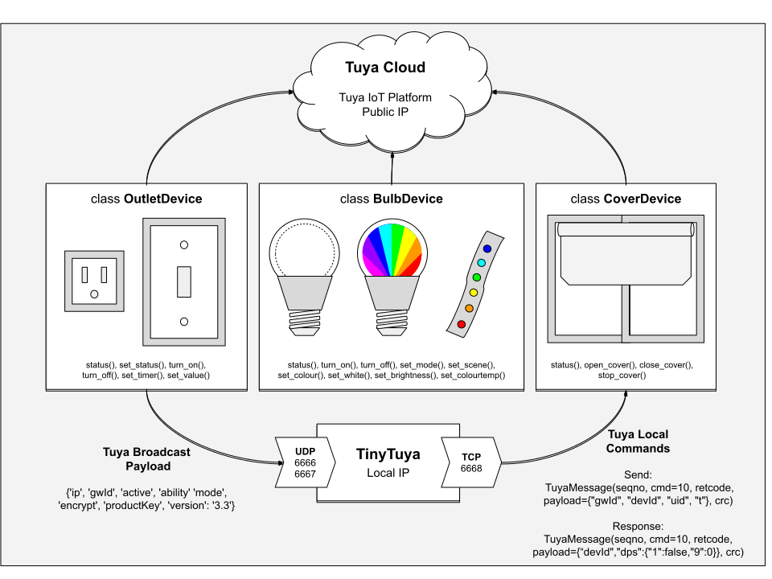

# TinyTuya

[](https://travis-ci.org/jasonacox/tinytuya)
[](https://badge.fury.io/py/tinytuya)

Python module to interface with Tuya WiFi smart devices

## Description

This python module controls and monitors [Tuya](https://en.tuya.com/) compatible WiFi Smart Devices (Plugs, Switches, Lights, Window Covers, etc.) using the local area network (LAN).  This is a compatible replacement for the `pytuya` PyPi module.

[Tuya](https://en.tuya.com/) devices are designed to communicate with the TuyaCloud but many also expose a local area network API, allowing us to directly control the devices without using the cloud. This python module provides a socket based way to synchronous poll status and issue commands to these devices.



NOTE: This module requires the devices to have already been **activated** by Smart Life App (or similar).

## TinyTuya Setup  

Install pip and python modules if you haven't already.

```bash
# Install PIP
 sudo apt-get install python-crypto python-pip  # for RPi, Linux

 # Install TinyTuya
 python -m pip install tinytuya
 ```

The PyPI module will attempt to install `pycryptodome` if you don't have it. The modules `pycrypto`, `Crypto` or `pyaes` could be used instead.

## Tuya Device Preparation

Controlling and monitoring Tuya devices on your network requires the following:
* *IP* - The network address (IPv4) of the device e.g. 10.0.1.100 
* *ID* - The unique identifier for the Tuya device
* *VERSION* - The Tuya protocol version used (3.1 or 3.3)
* *LOCAL_KEY* - The security key created to encrypt and decrypt communication. Devices running the latest protocol version 3.3 (e.g. Firmware 1.0.5 or above) will require a device *LOCAL_KEY* to read the status. Both 3.1 and 3.3 devices will require a device *LOCAL_KEY* to control the device.

### Network Scanner

TinyTuya has a built in network scanner that can be used to find Tuya Devices on your local network. It will show *IP*, *ID* and *VERSION* for each device.  

```bash
python -m tinytuya scan
```

### Setup Wizard

TinyTuya has a built in setup Wizard that uses the Tuya IoT Cloud Platform to generate a JSON list (devices.json) of all your registered devices. This includes the secret *LOCAL_KEY* as well as the *Name* of each device.

Follow the instructions below to get the *LOCAL_KEYs*:

1. Download the "Smart Life" App, available for iPhone or Android. Pair all of your Tuya devices (this is important as you cannot access a device that has not been paired).  
    * https://itunes.apple.com/us/app/smart-life-smart-living/id1115101477?mt=8
    * https://play.google.com/store/apps/details?id=com.tuya.smartlife&hl=en

2. Run the TinyTuya scan to get a list of Tuya devices on your network along with their device *IP*, *ID* and *VERSION* number (3.1 or 3.3):
    ```bash
    python -m tinytuya scan
    ```
    **NOTE:** You will need to use one of the displayed Device *IDs* for step 4.

3. **Set up a Tuya Account**:
    * Create a Tuya Developer account on [iot.tuya.com](https://iot.tuya.com/) and log in.
    * Click on "Cloud" icon -> Create a project (remember the Authorization Key: *API ID* and *Secret* for below)
    * Click on "Cloud" icon -> select your project -> Project Overview -> Linked Device -> Link devices by App Account (tab)
    * Click 'Add App Account' and it will display a QR code. Scan the QR code with the *Smart Life app* on your Phone (see step 1 above) by going to the "Me" tab in the *Smart Life app* and clicking on the QR code button [..] in the upper right hand corner of the app. When you scan the QR code, it will link all of the devices registered in your "Smart Life" app into your Tuya IoT project.
    * **IMPORTANT** Under "API Management" -> "API Products" and ensure the API groups have status "Subscribed": Smart Home Devices Management, Authorization and Smart Home Family Management ([see screenshot here](https://user-images.githubusercontent.com/836718/111419675-1d0d3f80-86a7-11eb-81ad-f6078ee391fe.png)) - Make sure you authorize your Project to use these 3 API groups:
        - Click each of the API boxes
        - Click "Projects" tab
        - Click "**New Authorization**" button
        - Select your Project from the dropdown and click OK ([see screenshot here](https://user-images.githubusercontent.com/836718/111578175-d5eb8100-8770-11eb-93b3-46342b1a67fa.png))

4. **Run Setup Wizard**:
    * From your Linux/Mac/Win PC run the TinyTuya Setup **Wizard** to fetch the  *LOCAL_KEYs* for all of your registered devices:
      ```bash
      python -m tinytuya wizard   # use -nocolor for non-ANSI-color terminals
      ```
    * The **Wizard** will prompt you for the *API ID* key, API *Secret*, API *Region* (us, eu, cn or in) from your Tuya IoT project noted above.  It will also ask for a sample *Device ID*.  Use one from step 2 above or found in the Device List on your Tuya IoT project.
    * The **Wizard** will poll the Tuya IoT Cloud Platform and print a JSON list of all your registered devices with the "name", "id" and "key" of your registered device(s). The "key"s in this list are the Devices' *LOCAL_KEY* you will use to access your device.
    * In addition to displaying the list of devices, **Wizard** will create a local file `devices.json`.  TinyTuya will use this file to provide additional details to scan results from `tinytuya.scanDevices()` or when running `python -m tinytuya` to scan your local network.  
    * The **Wizard** will ask if you want to poll all the devices. If you do, it will display the status of all devices on records and create a `snapshot.json` file with the results.

Notes:
* If you ever reset or re-pair your smart devices, the *LOCAL_KEY* will be reset and you will need to repeat the steps above.
* The TinyTuya *Wizard* was inspired by the TuyAPI CLI which is an alternative way to fetch the *LOCAL_KEYs*: `npm i @tuyapi/cli -g` and run `tuya-cli wizard`  
* For a helpful video walk-through of getting the *LOCAL_KEYs* you can also watch this great _Tech With Eddie_ YouTube tutorial: <https://youtu.be/oq0JL_wicKg>.


## Programming with TinyTuya

After importing tinytuya, you create a device handle for the device you want to read or control.  Here is an example for a Tuya smart switch or plug:

```python
    import tinytuya

    d = tinytuya.OutletDevice('DEVICE_ID_HERE', 'IP_ADDRESS_HERE', 'LOCAL_KEY_HERE')
    d.set_version(3.3)
    data = d.status() 
    print('set_status() result %r' % data)
```

### TinyTuya Module Classes and Functions 
```
Global Functions
    devices = scanDevices()            # returns dictionary of devices found on local network
    scan()                             # interactive scan of local network
    wizard()                           # interactive setup wizard

Classes
    OutletDevice(dev_id, address, local_key=None, dev_type='default')
    CoverDevice(dev_id, address, local_key=None, dev_type='default')
    BulbDevice(dev_id, address, local_key=None, dev_type='default')

        dev_id (str): Device ID e.g. 01234567891234567890
        address (str): Device Network IP Address e.g. 10.0.1.99 or 0.0.0.0 to auto-find
        local_key (str, optional): The encryption key. Defaults to None.
        dev_type (str): Device type for payload options (see below)

 Functions:

    json = status()                    # returns json payload
    set_version(version)               # 3.1 [default] or 3.3
    set_socketPersistent(False/True)   # False [default] or True
    set_socketNODELAY(False/True)      # False or True [default]
    set_socketRetryLimit(integer)      # retry count limit [default 5]
    set_socketTimeout(self, s)         # set connection timeout in seconds [default 5]
    set_dpsUsed(dpsUsed)               # set data points (DPs)
    set_retry(retry=True)              # retry if response payload is truncated
    set_status(on, switch=1)           # Set status of the device to 'on' or 'off' (bool)
    set_value(index, value)            # Set int value of any index.
    heartbeat()                        # Send heartbeat to device
    updatedps(index=[1])               # Send updatedps command to device
    turn_on(switch=1)                  # Turn on device / switch #
    turn_off(switch=1)                 # Turn off
    set_timer(num_secs)                # Set timer for num_secs
    set_debug(toggle, color)           # Activate verbose debugging output
    set_sendWait(num_secs)             # Seconds to wait after sending for response

    OutletDevice:
        set_dimmer(percentage):
        
    CoverDevice:
        open_cover(switch=1):  
        close_cover(switch=1):
        stop_cover(switch=1):

    BulbDevice
        set_colour(r, g, b):
        set_hsv(h, s, v):
        set_white(brightness, colourtemp):
        set_white_percentage(brightness=100, colourtemp=0):
        set_brightness(brightness):
        set_brightness_percentage(brightness=100):
        set_colourtemp(colourtemp):
        set_colourtemp_percentage(colourtemp=100):
        set_scene(scene):             # 1=nature, 3=rave, 4=rainbow
        set_mode(mode='white'):       # white, colour, scene, music
        result = brightness():
        result = colourtemp():
        (r, g, b) = colour_rgb():
        (h,s,v) = colour_hsv()
        result = state():
```

### TinyTuya Error Codes

Starting with v1.2.0 TinyTuya functions will return error details in the JSON data responses instead of raising exceptions.  The format for this response:

```json
{ "Error":"Invalid JSON Payload", "Err":"900", "Payload":"{Tuya Message}" }'
```

The "Err" number will be one of these:

* 900 (ERR_JSON) - Invalid JSON Response from Device
* 901 (ERR_CONNECT) - Network Error: Unable to Connect
* 902 (ERR_TIMEOUT) - Timeout Waiting for Device
* 903 (ERR_RANGE) - Specified Value Out of Range
* 904 (ERR_PAYLOAD) - Unexpected Payload from Device
* 905 (ERR_OFFLINE) - Network Error: Device Unreachable
* 906 (ERR_STATE) - Device in Unknown State
* 907 (ERR_FUNCTION) - Function Not Supported by Device

### Example Usage

See the sample python script [test.py](test.py) for an OutletDevice example or look in the [examples](examples) directory for other scripts.

```python
    import tinytuya

    """
    OUTLET Device
    """
    d = tinytuya.OutletDevice('DEVICE_ID_HERE', 'IP_ADDRESS_HERE', 'LOCAL_KEY_HERE')
    d.set_version(3.3)
    data = d.status()  

    # Show status and state of first controlled switch on device
    print('Dictionary %r' % data)
    print('State (bool, true is ON) %r' % data['dps']['1'])  

    # Toggle switch state
    switch_state = data['dps']['1']
    data = d.set_status(not switch_state)  # This requires a valid key
    if data:
        print('set_status() result %r' % data)

    # On a switch that has 4 controllable ports, turn the fourth OFF (1 is the first)
    data = d.set_status(False, 4)
    if data:
        print('set_status() result %r' % data)
        print('set_status() extra %r' % data[20:-8])

    """
    RGB Bulb Device
    """
    d = tinytuya.BulbDevice('DEVICE_ID_HERE', 'IP_ADDRESS_HERE', 'LOCAL_KEY_HERE')
    d.set_version(3.3)  # IMPORTANT to set this regardless of version
    data = d.status()

    # Show status of first controlled switch on device
    print('Dictionary %r' % data)

    # Set to RED Color - set_colour(r, g, b):
    d.set_colour(255,0,0)  

    # Brightness: Type A devices range = 25-255 and Type B = 10-1000
    d.set_brightness(1000)

    # Set to White - set_white(brightness, colourtemp):
    #    colourtemp: Type A devices range = 0-255 and Type B = 0-1000
    d.set_white(1000,10)

```

### Encryption notes

These devices uses AES encryption which is not available in the Python standard library. There are three options:

 1) PyCryptodome (recommended)
 2) PyCrypto
 3) pyaes (note Python 2.x support requires https://github.com/ricmoo/pyaes/pull/13)


### Scan Tool 
The function `tinytuya.scan()` will listen to your local network (UDP 6666 and 6667) and identify Tuya devices broadcasting their IP, Device ID, ProductID and Version and will print that and their stats to stdout.  This can help you get a list of compatible devices on your network. The `tinytuya.deviceScan()` function returns all found devices and their stats (via dictionary result).

You can run the scanner from the command line using this:
  ```bash
  python -m tinytuya
  ```

By default, the scan functions will retry 15 times to find new devices. If you are not seeing all your devices, you can increase max_retries by passing an optional arguments (eg. 50 retries):

  ```bash
  # command line
  python -m tinytuya 50
  ```

  ```python
  # invoke verbose interactive scan
  tinytuya.scan(50)

  # return payload of devices
  devices = tinytuya.deviceScan(false, 50)
  ```

## Troubleshooting

* Tuya devices only allow one TCP connection at a time.  Make sure you close the TuyaSmart or SmartLife app before using *TinyTuya* to connect.
* Some devices ship with older firmware that may not work with *TinyTuya*. If you're experiencing issues, please try updating the device's firmware in the official app.
* The LOCAL KEY for Tuya devices will change every time a device is removed and re-added to the TuyaSmart app. If you're getting decrypt errors, try getting the key again as it might have changed.
* Some devices with 22 character IDs will require additional setting to poll correctly - here is an example:
  ```python
    a = tinytuya.OutletDevice('here_is_my_key', '192.168.x.x', 'secret_key_here', 'device22')
    a.set_version(3.3)
    a.set_dpsUsed({"1": None})  # This needs to be a datapoint available on the device
    data =  a.status()
    print(data)
  ```
* Windows 10 Users - TinyTuya `wizard` and `scan` interactive tools use ANSI color. This will work correctly in PowerShell but will show cryptic escape codes when run in Windows `CMD`.  You can fix this by using the `-nocolor` option on tinytuya, or by changing the Windows `CMD` console registry to process ANSI escape codes by doing something like this:
  ```
  reg add HKEY_CURRENT_USER\Console /v VirtualTerminalLevel /t REG_DWORD /d 0x00000001 /f
  ```

## Tuya Data Points - DPS Table

The Tuya devices send back data points (DPS) also called device function points, in a json string.  The DPS attributes define the state of the device.  Each key in the DPS dictionary refers to key value pair, the key is the DP ID and its value is the dpValue. You can refer to the [Tuya developer platform](https://iot.tuya.com/index/) for definition of function points for the products. 

The following table represents several of the standard Tuya DPS values and their properties. It represents data compiled from Tuya documentation and self-discovery. Devices may vary. Feedback or additional data would would be appreciated.  Please submit a Issue or Pull Request if you have additional data that would be helpful for others.

### Version 3.1 Devices

#### Version 3.1 - Plug or Switch Type
| DP ID        | Function Point | Type        | Range       | Units |
| ------------- | ------------- | ------------- | ------------- |------------- |
|1|Switch|bool|True/False||
|2|Countdown?|integer|0-86400|s|
|4|Current|integer|0-30000|mA|
|5|Power|integer|0-50000|W|
|6|Voltage|integer|0-5000|V|

#### Version 3.1 - Light Type (RGB)
| DP ID        | Function Point | Type        | Range       | Units |
| ------------- | ------------- | ------------- | ------------- |------------- |
| 1|Switch|bool|True/False||
| 2|Mode|enum|white,colour,scene,music||
| 3|Bright|integer|10-1000*||
| 4|Color Temp|integer|0-1000*||
| 5|Color|hexstring|r:0-255,g:0-255,b:0-255,h:0-360,s:0-255,v:0-255|rgb+hsv|

### Version 3.3 Devices

#### Version 3.3 - Plug, Switch, Power Strip Type
| DP ID        | Function Point | Type        | Range       | Units |
| ------------- | ------------- | ------------- | ------------- |------------- |
|1|Switch 1|bool|True/False||
|2|Switch 2|bool|True/False||
|3|Switch 3|bool|True/False||
|4|Switch 4|bool|True/False||
|5|Switch 5|bool|True/False||
|6|Switch 6|bool|True/False||
|7|Switch 7/usb|bool|True/False||
|9|Countdown 1|integer|0-86400|s|
|10|Countdown 2|integer|0-86400|s|
|11|Countdown 3|integer|0-86400|s|
|12|Countdown 4|integer|0-86400|s|
|13|Countdown 5|integer|0-86400|s|
|14|Countdown 6|integer|0-86400|s|
|15|Countdown 7|integer|0-86400|s|
|17|Add Electricity|integer|0-50000|kwh|
|18|Current|integer|0-30000|mA|
|19|Power|integer|0-50000|W|
|20|Voltage|integer|0-5000|V|
|21|Test Bit|integer|0-5|n/a|
|22|Voltage coe|integer|0-1000000||
|23|Current coe|integer|0-1000000||
|24|Power coe|integer|0-1000000||
|25|Electricity coe|integer|0-1000000||
|26|Fault|fault|ov_cr||

#### Version 3.3 - Dimmer Switch
| DP ID        | Function Point | Type        | Range       | Units |
| ------------- | ------------- | ------------- | ------------- |------------- |
| 1|Switch|bool|True/False||
| 2|Brightness|integer|10-1000*||
| 3|Minimum of Brightness|integer|10-1000*||
| 4|Type of light source1|enum|LED,incandescent,halogen||
| 5|Mode|enum|white||

#### Version 3.3 - Light Type (RGB)
| DP ID        | Function Point | Type        | Range       | Units |
| ------------- | ------------- | ------------- | ------------- |------------- |
| 20|Switch|bool|True/False||
| 21|Mode|enum|white,colour,scene,music||
| 22|Bright|integer|10-1000*||
| 23|Color Temp|integer|0-1000||
| 24|Color|hexstring|h:0-360,s:0-1000,v:0-1000|hsv|
| 25|Scene|string|n/a||
| 26|Left time|integer|0-86400|s|
| 27|Music|string|n/a||
| 28|Debugger|string|n/a||
| 29|Debug|string|n/a||

#### Version 3.3 - Automated Curtain Type
| DP ID        | Function Point | Type        | Range       | Units |
| ------------- | ------------- | ------------- | ------------- |------------- |
|1|Curtain Switch 1|enum|open, stop, close, continue||
|2|Percent control 1|integer|0-100|%|
|3|Accurate Calibration 1|enum|start, end||
|4|Curtain Switch 2|enum|open, stop, close, continue||
|5|Percent control 2|integer|0-100||
|6|Accurate Calibration 2|enum|start, end||
|8|Motor Steer 1|enum|forward, back||
|9|Motor steer 2|enum|forward, back||
|10|Quick Calibration 1|integer|1-180|s|
|11|Quick Calibration 2|integer|1-180|s|
|12|Motor Mode 1|enum|strong_power, dry_contact||
|13|Motor Mode 2|enum|strong_power, dry_contact||
|14|Light mode|enum|relay, pos, none||

#### Version 3.3 - Fan Switch Type
| DP ID        | Function Point | Type        | Range       | Units |
| ------------- | ------------- | ------------- | ------------- |------------- |
|1|Fan switch|bool|True/False|n/a|
|2|Fan countdown|integer|0-86400|s|
|3|Fan speed|enum|level_1, level_2, level_3, level_4, level_5||
|4|Fan speed|integer|1-100|%|
|5|Fan light switch|bool|True/False||
|6|Brightness integer|integer|10-1000||
|7|Fan light countdown|integer|0-86400||
|8|Minimum brightness|integer|10-1000||
|9|Maximum brightness|integer|10-1000||
|10|Mode|enum|white||
|11|Power-on state setting|enum|off, on, memory||
|12|Indicator status setting|enum|none, relay, pos||
|13|Backlight switch|bool|True/False||

#### Version 3.3 - Sensor Type
| DP ID        | Function Point | Type        | Range       | Units |
| ------------- | ------------- | ------------- | ------------- |------------- |
|1|Door Sensor|bool|True/False||
|2|Battery level state|enum|low, middle, high||
|3|Battery level|integer|0-100|%|
|4|Temper alarm|bool|True/False||
|5|Flooding Detection State|enum|alarm, normal||
|6|Luminance detection state|enum|low, middle, high, strong||
|7|Current Luminance|integer|0-100|%|
|8|Current Temperature|integer|400-2000||
|9|Current Humidity|integer|0-100|%|
|10|Shake State|enum|normal, vibration, drop, tilt||
|11|Pressure State|enum|alarm, normal||
|12|PIR state|enum|pir, none||
|13|Smoke Detection State|enum|alarm, normal||
|14|Smoke value|integer|0-1000||
|15|Alarm Volume|enum|low, middle, high, mute||
|16|Alarm Ringtone|enum|1, 2, 3, 4, 5||
|17|Alarm Time|integer|0-60|s|
|18|Auto-Detect|bool|True/False||
|19|Auto-Detect Result|enum|checking, check_success, check_failure, others||
|20|Preheat|bool|True/False||
|21|Fault Alarm|fault|fault, serious_fault, sensor_fault, probe_fault, power_fault|Barrier|
|22|Lifecycle|bool|True/False||
|23|Alarm Switch|bool|True/False||
|24|Silence|bool|True/False||
|25|Gas Detection State|enum|alarm, normal||
|26|Detected Gas|integer|0-1000||
|27|CH4 Detection State|enum|alarm, normal||
|28|CH4 value|integer|0-1000||
|29|Alarm state|enum|alarm_sound, alarm_light, alarm_sound_light, normal||
|30|VOC Detection State|enum|alarm, normal||
|31|VOC value|integer|0-999||
|32|PM2.5 state|enum|alarm, normal||
|33|PM2.5 value|integer|0-999||
|34|CO state|enum|alarm, normal||
|35|CO value|integer|0-1000||
|36|CO2 Detection State|enum|alarm, normal||
|37|CO2 value|integer|0-1000||
|38|Formaldehyde Detection State|enum|alarm, normal||
|39|CH2O value|integer|0-1000||
|40|Master mode|enum|disarmed, arm, home, sos||
|41|Air quality index|enum|level_1, level_2, level_3, level_4, level_5, level_6||

NOTE (*) - The range can vary depending on the device. As an example, for dimmers, it may be 10-1000 or 25-255.

### Tuya References

* Tuya Hardware Development - Protocol: https://developer.tuya.com/en/docs/iot/device-development/embedded-software-development/mcu-development-access/wifi-mcu-sdk-solution/tuya-cloud-universal-serial-port-access-protocol?id=K9hhi0xxtn9cb
* TuyaMCU listing of Tuya DP IDs: https://tasmota.github.io/docs/TuyaMCU/#switches-or-plugspower-strips

## Credits

  * TuyaAPI https://github.com/codetheweb/tuyapi by codetheweb and blackrozes
    For protocol reverse engineering, additional protocol reverse engineering from jepsonrob and clach04
  * PyTuya https://github.com/clach04/python-tuya by clach04
    The origin of this python module (now abandoned), nijave pycryptodome support and testing, Exilit for unittests and docstrings, mike-gracia for improved Python version support, samuscherer for RGB Bulb support, magneticflux for improved Python version support, sean6541 for initial PyPi package and Home Assistant support <https://github.com/sean6541/tuya-homeassistant>, ziirish - for resolving a dependency problem related to version numbers at install time
  * https://github.com/rospogrigio/localtuya-homeassistant by rospogrigio
    Updated pytuya to support devices with Device IDs of 22 characters

## Related Projects

  * https://github.com/sean6541/tuyaapi Python API to the web api
  * https://github.com/codetheweb/tuyapi node.js
  * https://github.com/Marcus-L/m4rcus.TuyaCore - .NET
  * https://github.com/SDNick484/rectec_status/ - RecTec pellet smokers control (with Alexa skill)
